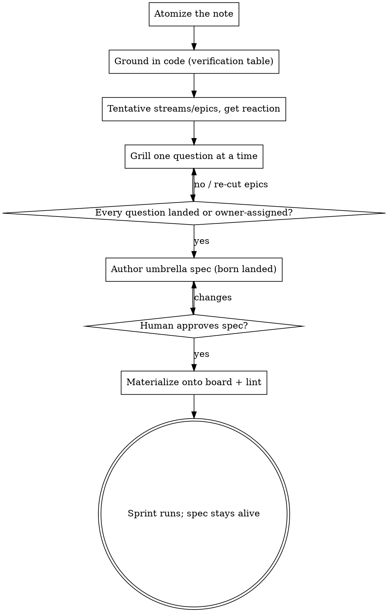

# Organizing Sprints

## Overview

Turn a raw multi-observation note into one **umbrella sprint spec**, then
materialize that spec onto the issue board as tickets with typed edges.
The note is testimony; the codebase is truth. Every observation is grounded
in code reality before it becomes work, every open question is landed by
grilling BEFORE the spec is authored, and the spec — not the board — is the
primary artifact: tickets, dependency edges, derived ExecPlans, and the next
milestone's reservations all flow from it, and its living sections track the
sprint through to retrospective.

(Successor to `issue-register`: real sprint usage showed that clustering +
ticket registration is one phase of this pipeline, not a standalone product.)

<HARD-GATE>
MULTIPLE observations only. A single idea — however fuzzy — goes to
doperpowers:brainstorming. One observation has nothing to cluster or cut.
</HARD-GATE>

<HARD-GATE>
The materialize phase is gated on the human approving the written spec.
Registering a sprint's worth of GitHub issues is an outward-facing batch
action — do not touch the board until the spec document is approved.
</HARD-GATE>

## The pipeline

Create a task per phase; complete them in order.

1. **Ingest & atomize** — parse the note into discrete atomic observations.
   Lose none; merge none silently. Where each observation came from (who
   said it, seeing what) rides along — it becomes the epic's context line.
2. **Ground every observation in code** — fan out parallel explorations by
   area (native subagents) and classify each
   observation against code reality (see The verification table below). A
   question the codebase can answer is answered by reading, never asked.
3. **Tentative decomposition** — cut streams and epics. An epic is an
   independently shippable purpose-unit; two observations share an epic
   only if they share a problem or outcome, not merely a topic or a page.
   Unsure whether two observations are one epic or two? Ask — over-merging
   hides independent shippables; over-splitting loses coherence. Present
   the tentative map and get a reaction BEFORE deep grilling.
4. **Grill until every question lands** — one question at a time, full
   record into the Decision Log (see The grill below). Milestone boundaries
   are grill questions too: work that outgrows this sprint is landed as a
   named reservation for the next milestone, not silently absorbed or
   dropped.
5. **Author the umbrella spec** — per `references/sprint-spec-template.md`,
   born landed: v1 already carries the grill's decisions. Acceptance
   criteria are observable behavior. No per-epic implementation plans —
   a big epic derives its own ExecPlan at dispatch time, from this document.
6. **Self-review, then the human gate** — scan for placeholders,
   contradictions, and untraceable observations (every atomized observation
   maps to an epic, a maintenance bundle, a deferral, or an explicit park).
   Commit the spec; ask the human to review it. Only their approval opens
   phase 7.
7. **Materialize onto the board** — see Materialization below. Often a
   separate session: the spec's tracking-map section is the handoff
   contract.
8. **Hand off, keep the spec alive** — show the board; dispatch per
   doperpowers:issue-tracker. During the sprint the spec's Progress /
   Decision Log / Surprises stay current; the retrospective closes it; its
   Deferred section seeds the next organizing run.

## The verification table

The heart of the grounding phase and the section the rest of the spec
builds on. Classify EVERY observation:

| class | meaning | what it demands |
|---|---|---|
| `[BUG]` | confirmed real defect | a diagnosis — cause, not just symptom — with evidence at the depth the claim needs (a surprising or contested row cites file:line; an obvious one doesn't) |
| `[MISREAD]` | observation contradicts code reality | correct the record AND extract the real requirement hiding under the misread — a wrong observation usually points at a real want, stated wrongly |
| `[BUILT]` / `[PARTIAL]` | already exists, fully or partly | no work, or the delta only — name where it lives |
| `[NOT-BUILT]` | absent | the sprint's real work |

Why this is non-negotiable: real usage caught an observation describing the
current layout as the opposite of what the code renders — trusted as
written, the sprint would have built the reverse of the actual requirement.
And features "assumed built" that were never built become invisible sprint
scope unless someone checks the assumption against the code.

## The grill

The interview protocol, adapted from doperpowers:brainstorming's grill:

- One question at a time, each with your recommended answer. Prefer
  multiple choice where the options are enumerable; open-ended is fine too.
- A question the codebase can answer is answered by reading, never asked.
- Sharpen fuzzy terms; stress-test with concrete scenarios; cross-reference
  the human's claims about current behavior with the code.
- Triage: grill what is fuzzy or important; don't grind already-clear notes
  to death across a large dump.

Two moves specific to this skill:

- **Auto-landed decisions** — when grounding dissolves every alternative,
  record the decision as `[DECIDED-AUTO]` with the code fact that killed
  the alternatives. It enters the Decision Log like any other decision,
  without spending a question on it.
- **Externally-owned questions** — a question only a specific person can
  answer (copy sign-off, business input) does not block authoring: record
  it in Open Questions with owner + deadline and keep moving.

Every landed decision is logged with its rejected alternatives and why each
lost.

## Materialization

Runs only after the human approves the spec; often in a fresh session (the
spec is self-contained).

- One ticket per epic via `board-register.sh` (doperpowers:issue-tracker):
  priority always; slices as `--parent` children; ordering as
  `--blocked-by`; grill-flagged parks at birth (`--state needs-human` for
  an externally-owned decision, `--state interactive-preferred` for
  product-core work, `--state deferred` for next-milestone reservations —
  notes required).
- Ticket bodies are fleshed to the pre-spec bar: self-contained, so a
  fresh-context worker can gate from the body alone. Carry the epic's
  decisions and acceptance criteria INTO the body, and cite the spec's epic
  section (path + epic id) for surrounding context — the citation is
  context, not a substitute for self-containment.
- Milestone + epic labels via raw `gh` are legal; states and edges go
  through the scripts only (the Board Write Hard Gate).
- **Disposition every pre-existing open ticket the sprint touches** —
  absorb into an epic, defer with a note, re-cut milestone/labels, or flag
  as a close candidate. A sprint that only adds tickets leaves the board
  lying.
- Deferred-section reservations are registered as `deferred` tickets NOW —
  scope-outs become tickets the moment the deferral is decided
  (issue-tracker's deferral rule).
- Finish with `board-lint.sh` at 0 FAIL, and write the record (epic → issue
  number, edges, dispositions) back into the spec's tracking-map section.

## Common mistakes

| Mistake | Fix |
|---|---|
| Building from the note | The verification table is truth; the note is testimony. A misread built as-written ships the reverse of what was wanted. |
| Authoring the spec, then grilling | Born-landed beats revised: land the grill first, author once. |
| Running on a single idea | Wrong skill — doperpowers:brainstorming. |
| Treating the whole dump as one project | It is usually several independent shippables. Cut streams and epics first. |
| Per-epic implementation plans in the umbrella | The umbrella stops at observable acceptance criteria; ExecPlans derive downstream at dispatch time. |
| Silent drops or merges | Every atomized observation traceable to an epic, a bundle, a deferral, or an explicit park. |
| Materializing before spec approval | Outward-facing batch action; hard-gated on the human's review. |
| Re-running this skill on already-materialized tickets | Duplicate process. Targeted reinforcement instead: answer on the tickets, register only the deltas. |
| Absorbing next-milestone ideas "while we're here" | Wrong milestoning is scope creep. Reserve them in the Deferred section + a `deferred` ticket. |
| Skipping existing-ticket disposition | The board must reflect the sprint, not accumulate parallel truths. |

## Scale

The dump sets the scale — a handful of loose observations or a quarter's
worth of accumulated notes both run the same phases; only the artifacts
compress or grow. Epic count, ticket count, and document length are
outputs of the shape rules (purpose-unit epics, gate-passing tickets),
never targets: no floor, no ceiling. Never dropped, at any scale: the
verification table, observable acceptance criteria, the Decision Log with
rejected alternatives, the tracking map, and the Deferred section.
